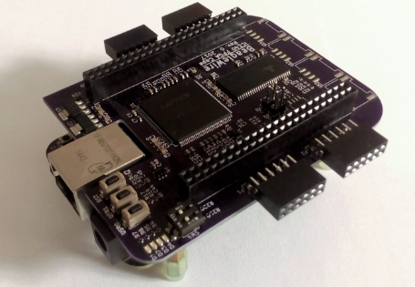

# Getting BBB Ready for BeagleWire

## BeagleWire:

<p align="center">
    
</p>

## 1) Flashing BeagleBone Black With New Image

- First of all download this image from beagleboard site: [AM3358 Debian 10.3 2020-04-06 4GB SD IoT](https://debian.beagleboard.org/images/bone-debian-10.3-iot-armhf-2020-04-06-4gb.img.xz)
- Mount the sdcard
- Decompress the .xz file
    > xz -d BBB*.xz
- This gives you the image file: BBB*.img. Write the image to the memory card 
    > sudo dd if=./BBB*.img of=/dev/sdX

### Booting from SD Card:

- GPMC has been used to transfer the data between FPGA cape and ARM.
- **GPMC and EMMC pins are multiplexed**, so if one needs to use GPMC then BBB should be booted from **SD Card Only.**

- For details steps once can follow below tutorials:
    1. [Booting your BeagleBone board from a SD card](https://subscription.packtpub.com/book/hardware_and_creative/9781785285059/1/ch01lvl1sec14/booting-your-beaglebone-board-from-a-sd-card)
    2. [Derekmolly's tutorial](http://derekmolloy.ie/write-a-new-image-to-the-beaglebone-black/)
    3. [Adafruit tutorial](https://learn.adafruit.com/beaglebone-black-installing-operating-systems/flashing-the-beaglebone-black)


---

## 2) Upgrade the software on your Beagle

### Connect BeagleBoard to the internet
- For detailed steps you can follow this: [Get connected to the Internet](https://beagleboard.org/upgrade#:~:text=There%20are%204%20main%20steps,up%20scripts%20and%20Linux%20kernel&text=Update%20examples%20in%20the%20Cloud9%20IDE%20workspace)

### Update the boot-up scripts and Linux kernel
```
cd /opt/scripts
git pull
sudo tools/update_kernel.sh
sudo shutdown -r now
```
### Update distribution components
```
sudo apt update
sudo apt upgrade
```
### Addition References: [Upgrade the software on your Beagle](https://beagleboard.org/upgrade#:~:text=There%20are%204%20main%20steps,up%20scripts%20and%20Linux%20kernel&text=Update%20examples%20in%20the%20Cloud9%20IDE%20workspace)


---

## 3) Installing Linux Headers
```
sudo apt install linux-headers-$(uname -r)
```

---
## 4) Getting BeagleWire Software:

```
 git clone https://github.com/BeagleWire/BeagleWire 
 git checkout testing   
```
---
## 5) Device Tree Overlay:

- Device Tree Overlay is required for initializing the spidev to program the FPGA and gpmc to communicate with FPGA for data transfer.

```
git clone https://github.com/BeagleWire/BeagleBoard-DeviceTrees
cd BeagleBoard-DeviceTrees
make
sudo cp src/arm/overlays/BW-ICE40Cape-00A0.dtbo /lib/firmware

#  Create dtb backup:
sudo cp /boot/dtbs/4.19*/am335x-boneblack-uboot-univ.dtb am335x-boneblack-uboot-univ.dtb.backup

# Install the new dtb:
cd BeagleBoard-DeviceTrees
sudo cp src/arm/am335x-boneblack-uboot-univ.dtb /boot/dtbs/4.19*/
```

---
## 6) Writing EEPROM configuration contents

- BeagleWire cape has a EEPROM memory, so that the BBB device overlay is automatically loaded up on each boot up. 
- EEPROM contents and loading script are located in BeagleWire software repository.
- **So once we program the eeprom, then we don't have to explicitly add overlay info in uEnv.txt at any addr4**
- If `BW-ICE40Cape-00A0.dtbo` is present in /lib/firmware then it will be automatically loaded.

```
cd BeagleWire/EEPROM_Cape/
sudo ./load_eeprom.sh
```
---
## 7) LED Blinking:
- There are two ways to program the FPGA:
1. First we program the onboard SPI flash, after reset the fpga is booted from spi flash. Even after power cut the program is retain.
2. Directly programmnig the FPGA using custom LKM, in this method FPGA is directly programmed with bitstream and after power cut program is no longer exist.


### SPI Programming method for LED Blink:

1. Ensure you have added `BW-ICE40Cape-00A0.dtbo` overlay in /lib/firmware.

- Example Directory: [blink_leds](https://github.com/BeagleWire/BeagleWire/tree/master/examples/blink_leds)
- The LEDs are blink via simple counter logic

### Flash the FPGA SPI with blink_leds bitstream 
```
cd examples/blink_leds

# If the fpga tools present on BBB
make

# Else scp the .bin file in Beaglewire/examples/blink_leds
# In host computer go to Beaglewire/examples/blink_leds
# make
# Command to send it to FPGA: 
# scp blink.bin debian@192.168.6.2:/home/debian/Beaglewire/examples/blink_leds

# Loading SPI flash after FPGA reset, it will be boot up on SPI.
make load_spi

# Reset the FPGA for running bitsream (RST Button on BeagleWire)
```

### FPGA LKM method for LED Blink:
- To Be added